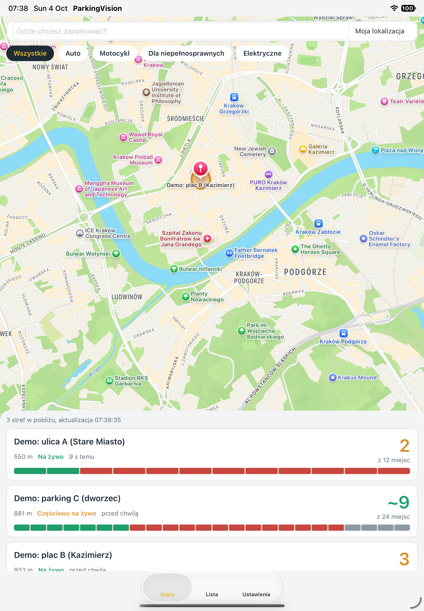
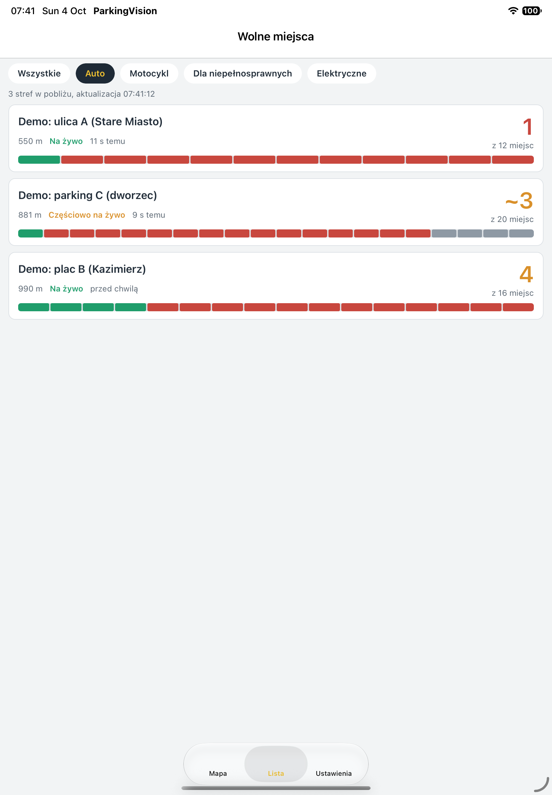
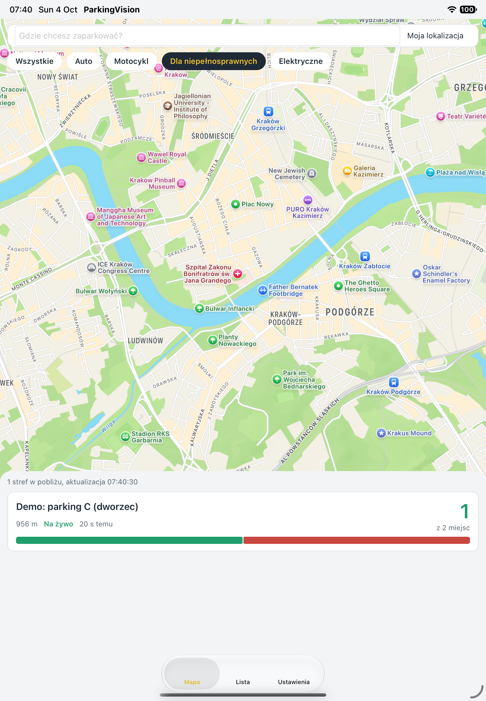
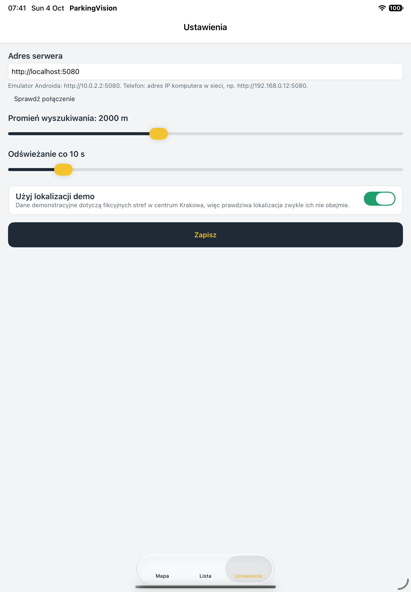

# 07 — Aplikacja MAUI (kierowca)

> Dokument żywy. Kod: `src/ParkingVision.Maui`. Założenia: A-008, A-012, A-013.
> **Status:** wersja z Apple Maps była zbudowana i uruchomiona na symulatorze iOS (iPad A16) 2026-10-04. Od zmian 009–012 mapa jest **zależna od platformy** (iOS: Apple Maps, Android: OpenStreetMap przez Leaflet w WebView), a UI jest **dwujęzyczny (pl/en)** — te zmiany **nie były jeszcze kompilowane ani uruchamiane**. Android: nie uruchamiano. Środowisko: `10-dev-environment.md`.

## Cel i odbiorca
Kierowca, który **w drodze lub przed wyjazdem chce wiedzieć, gdzie zaparkować**. Zadanie główne: w < 5 s zobaczyć, ile miejsc jest wolnych w okolicy wskazanego punktu i jak bardzo można temu ufać. Wersja startowa: wskazanie lokalizacji (GPS lub adres) → lista/mapa stref z liczbą wolnych miejsc. Później: opłata postoju (A-013).

## Architektura aplikacji
MVVM (CommunityToolkit.Mvvm), DI w `MauiProgram`, Shell z trzema zakładkami + trasa `zone`.

| Warstwa | Pliki |
|---|---|
| Usługi | `Services/AppSettings` (Preferences: adres API, promień, odświeżanie, lokalizacja demo, **język**, **adres kafelków mapy**), `SearchContext` (środek wyszukiwania + filtr typu), `ParkingApiClient` (HTTP), `LocationService` (GPS lub lokalizacja demo), `MapHtml` (strona mapy Leaflet, tylko Android) |
| Mapa | `Views/Maps/IZoneMap` + `ZoneMapFactory` wybiera implementację: `AppleZoneMap` (iOS/Mac Catalyst, `#if IOS \|\| MACCATALYST`) lub `LeafletZoneMap` (Android) |
| Lokalizacja | `Localization/Loc` (przełączanie języka w locie), `TExtension` (`{loc:T Key=…}` w XAML); teksty i reguły liczby mnogiej w `ParkingVision.Core/Localization` (testowane) |
| ViewModele | `MapViewModel` (mapa + lista, singleton), `ZoneDetailViewModel` (`[QueryProperty] id`), `SettingsViewModel`, `Presentation` (teksty, kolory, progi — jedno miejsce) |
| Widoki | `MapPage`, `ZonesListPage`, `ZoneDetailPage`, `SettingsPage`; komponenty `ZoneCard`, `VehicleFilterBar`, `CapacityBar` |
| Kontrakty | referencja do `ParkingVision.Core` (te same DTO co API) |

Odświeżanie: timer w widoku (domyślnie 10 s) tylko gdy ekran jest widoczny; równoległe odświeżenia są ignorowane (semafor).

## Nawigacja
```
[Mapa] ──tap „Szczegóły” w dymku mapy / karty──▶ [Szczegóły strefy]
[Lista] ─tap karty────────────▶ [Szczegóły strefy] ──▶ system: nawigacja do strefy
[Ustawienia]
```

## Tożsamość wizualna (decyzje projektowe)
Temat: **asfalt i farba drogowa**. Interfejs ma wyglądać jak oznakowanie parkingu widziane z góry; jedynym „bohaterem” jest **pasek miejsc (`CapacityBar`)** — jedna komórka = jedno miejsce. Reszta jest cicha.

| Token | Wartość | Użycie |
|---|---|---|
| Asphalt | `#1E2A36` | pasek zakładek, tekst, przyciski główne |
| Paint | `#F4C430` | akcent (żółta linia malowana): aktywna zakładka, tekst na przycisku głównym, aktywny filtr |
| Free | `#1F9D6B` | wolne |
| Warn | `#D9902A` | mało wolnych / dane częściowe |
| Taken | `#C8473E` | zajęte / prawie pełno |
| Unknown | `#8E99A4` | brak danych / szacunek |
| Surface / Card | `#F2F4F5` / `#FFFFFF` | tło / karty |
| TextMuted / Track | `#5B6773` / `#DDE2E6` | opisy / tło paska |

Typografia: czcionki systemowe (v0), skala 12 (opis) – 16 (tytuł karty) – 34/56 (liczba wolnych). Liczba wolnych jest największym elementem tekstowym, ale kolor niesie informację o dostępności, nie ozdobę.
Kolory zdefiniowane w `Resources/Styles/Colors.xaml` **i** `Palette.cs` — zmieniać oba.

Progi koloru strefy (`Presentation.Accent`): wolne ≥ 30% → Free, 10–30% → Warn, < 10% → Taken, brak danych → Unknown.

## Ekrany

### 1. Mapa (ekran startowy)
```
┌──────────────────────────────────────┐
│ ┌──────────────────────────────────┐ │
│ │ Gdzie chcesz zaparkować?   [Moja │ │  pływający pasek: adres + lokalizacja
│ └──────────────────────────────────┘ │
│ (Wszystkie)(Auto)(Motocykl)(Niepeł…) │  chipsy typu pojazdu (przewijane poziomo)
│                                      │
│        ◯ zielone / bursztynowe /     │  mapa: kółko w kolorze dostępności
│     ◯     czerwone kółka stref  ◯    │  + znacznik; tap otwiera dymek z przyciskiem Szczegóły
│                                      │
│ ╭──────────────────────────────────╮ │
│ │ 3 stref w pobliżu, aktualizacja…│ │  panel dolny (sheet)
│ │ ┌──────────────────────────────┐ │ │
│ │ │ Demo: parking C       ~8     │ │ │  karta strefy
│ │ │ 812 m Częściowo na żywo  z 24│ │ │
│ │ │ ▇▇▇▇▇▇▇▇▇▇▇▇▇▇▇▇▇▇▇▇▇▇▇▇▇▇▇▇ │ │ │  pasek miejsc
│ │ └──────────────────────────────┘ │ │
│ ╰──────────────────────────────────╯ │
│ [ Mapa ]   Lista    Ustawienia       │
└──────────────────────────────────────┘
```
Zachowanie: mapa dopasowuje kadr do wszystkich stref i punktu wyszukiwania tylko przy zmianie środka lub liczby stref (nie „ucieka” przy każdym odświeżeniu). Panel dolny jest osobnym wierszem, więc nie zasłania mapy ani informacji o źródle map. Wpisanie adresu + Enter → geokodowanie → odświeżenie. „Moja lokalizacja” czyści adres i wraca do GPS/lokalizacji demo.

### 2. Lista
Te same karty i filtry co na mapie, pełny ekran, **pull-to-refresh**. Pusta lista: „Brak stref w tym promieniu. Zmień lokalizację albo zwiększ promień w ustawieniach.”

### 3. Szczegóły strefy
```
┌──────────────────────────────────────┐
│ ‹  Demo: parking C (dworzec)         │
│ ┌──────────────────────────────────┐ │
│ │ ~8  wolnych z 24 miejsc          │ │  hero: liczba + skąd wiemy
│ │     Częściowo na żywo            │ │
│ │ ▇▇▇▇▇▇▇ ▇▇▇▇▇▇▇▇▇▇▇▇▇ ▇▇▇▇      │ │  pasek: wolne | zajęte | brak danych
│ │ Kamery widzą 20 z 24 miejsc. Dla │ │  wyjaśnienie źródła (A-008)
│ │ pozostałych 4 szacujemy z biletów│ │
│ │ Aktualizacja: 4 s temu           │ │
│ │ Parking niestrzeżony, 4 zł/h…    │ │
│ └──────────────────────────────────┘ │
│ Miejsca     ✓ wolne ✕ zajęte ? brak  │
│ [01✓][02✕][03✓][04✕][05✕][06✓]       │  siatka 6 kolumn: kolor + symbol
│ [07✓] …            [D1 ♿ ✓][E1 ⚡ ✕] │
│ Parkomaty w strefie                  │
│ ┌ Parkomat C1 – 180 m, obsługuje 8 ┐ │
│ [      Nawiguj do strefy          ] │  przycisk główny (systemowa nawigacja)
│ [  Opłać postój (wkrótce)         ] │  nieaktywny (A-013)
└──────────────────────────────────────┘
```
Dostępność: stan miejsca zawsze jako **kolor + symbol** (✓ ✕ ?), nie tylko kolor.

### 4. Ustawienia
Adres serwera (+ „Sprawdź połączenie”), **język (Polski / English — działa od razu, bez „Zapisz”)**, promień (200–5000 m), częstotliwość odświeżania (3–60 s), przełącznik „Użyj lokalizacji demo” (domyślnie włączony — dane demo są fikcyjne, A-012), „Zapisz”.

## Teksty interfejsu (zasady)
Polski, zdania w trybie oznajmującym, bez przeprosin. Przycisk nazywa działanie („Nawiguj do strefy”, „Zapisz”). Błąd mówi, co się stało i co zrobić („Nie można połączyć się z serwerem (adres). Sprawdź adres w ustawieniach.”). Etykiety pewności: **Na żywo / Częściowo na żywo / Szacunek / Brak danych**. Liczba z `~` oznacza szacunek.

## Stany
| Stan | Zachowanie |
|---|---|
| Ładowanie | `ActivityIndicator` w nagłówku panelu / pull-to-refresh; poprzednie dane zostają widoczne |
| Brak sieci / API | komunikat w `StatusText`, bez crasha; timer próbuje dalej |
| Brak lokalizacji | komunikat z podpowiedzią (adres lub lokalizacja demo) |
| Brak wyników | komunikat o promieniu |

## Konfiguracja platform („Platform setup”)
1. `dotnet workload install maui`. Katalogi `Platforms/iOS` (z `SceneDelegate.cs`), `Platforms/Android` oraz ikona i splash (`Resources/AppIcon`, `Resources/Splash`) **są w repozytorium** (napisane ręcznie wg szablonu MAUI, zmiana 015) — `scripts/bootstrap-maui.*` jest już tylko awaryjnym sposobem odtworzenia ich z szablonu (usunąć `Platforms/`, uruchomić skrypt, ponownie dopisać wpisy z punktów 3–5 oraz `SceneDelegate.cs` i `UIApplicationSceneManifest`). Cele budowania: `net10.0-ios` (tylko macOS) i `net10.0-android`; Mac Catalyst usunięty (nigdy nie testowany).
2. **Mapa nie wymaga żadnego klucza ani konta na żadnej platformie:** iOS używa Apple Maps, Android używa OpenStreetMap (Leaflet). Android potrzebuje internetu na kafelki i bibliotekę Leaflet (CDN); bez sieci zakładka Mapa pokazuje komunikat, a Lista i Szczegóły działają.
3. **Android — uprawnienia:** `INTERNET`, `ACCESS_NETWORK_STATE`, `ACCESS_FINE_LOCATION`, `ACCESS_COARSE_LOCATION` — już w `Platforms/Android/AndroidManifest.xml`.
4. **Android — HTTP w dev:** `android:usesCleartextTraffic="true"` — już w manifeście (tylko do testów z lokalnym API; produkcyjnie HTTPS). Mapa korzysta z HTTPS, więc tego nie dotyczy.
5. **iOS:** w `Platforms/iOS/Info.plist` jest też `UIApplicationSceneManifest` z `SceneDelegate` (wymagane od iOS 27, zmiana 016), a w `Platforms/iOS/SceneDelegate.cs` sama klasa. Ponadto są już `NSLocationWhenInUseUsageDescription`, `NSLocalNetworkUsageDescription` i `NSAppTransportSecurity` → `NSAllowsLocalNetworking = true` (HTTP do lokalnego API w dev).
6. **Adres API:** symulator iOS → `http://localhost:5080` (domyślnie); emulator Androida → `http://10.0.2.2:5080` (domyślnie); telefon → IP komputera w LAN i reguła zapory dla portu 5080.
7. Windows nie jest celem (nie testowano).

Uruchomienie: `dotnet build src/ParkingVision.Maui -f net10.0-ios -t:Run` (lub `-f net10.0-android`, po `10-dev-environment.md`).

## Mapa (zależna od platformy)
- **Wybór:** iOS i Mac Catalyst → **Apple Maps** (pakiet `Microsoft.Maui.Controls.Maps`, dodawany do csproj tylko dla TFM `-ios` / `-maccatalyst`; `UseMauiMaps()` pod `#if PV_APPLE_MAPS`). Android → **OpenStreetMap** przez **Leaflet 1.9.4 w WebView** (`Services/MapHtml.cs`, `Views/Maps/LeafletZoneMap.cs`). Decyzja użytkownika (zmiana 012): Apple Maps działały bez konta i klucza, a płatny klucz Google Maps na Androidzie odpada.
- **Stała kompilacji `PV_APPLE_MAPS`** jest zdefiniowana w csproj dokładnie tam, gdzie dodawany jest pakiet Maps (TFM `-ios`, `-maccatalyst`), więc kod i pakiet zawsze się zgadzają; nie polegamy na symbolach `IOS` / `MACCATALYST` z SDK.
- **Wspólny interfejs:** `IZoneMap` (`Prepare`, `Show(strefy, lat, lon, promień)`, zdarzenie `ZoneOpened`); `MapPage` zna tylko interfejs. Dodanie platformy lub dostawcy = nowa implementacja w `ZoneMapFactory`.
- **iOS (Apple Maps):** kółko (70 m) i pinezka w kolorze dostępności; dymek pinezki otwiera ekran strefy. Kadr: promień = 130% odległości do najdalszej strefy (min. 300 m), ustawiany tylko przy zmianie środka lub liczby stref.
- **Android (Leaflet/OSM):** C# → mapa: `EvaluateJavaScriptAsync("pvSetZones(strefy, lat, lon, promień, etykiety)")`; mapa → C#: przycisk „Szczegóły” w dymku to link `pvapp://zone?id=N`, przechwytywany w `WebView.Navigating` i anulowany. Kadr: `fitBounds` na wszystkie strefy i punkt wyszukiwania.
- **Atrybucja OSM jest wymagana** licencją ODbL („© OpenStreetMap contributors”, prawy dolny róg mapy na Androidzie). Panel dolny jest osobnym wierszem i nie może jej zasłaniać.
- **Polityka kafelków OSM:** publiczny `tile.openstreetmap.org` tylko do demo/testów; wymaga identyfikowalnego Referer/User-Agent i może blokować żądania. Produkcyjnie własny/komercyjny dostawca kafelków przez `AppSettings.MapTileUrl`. `AppSettings.MapBaseUrl` (`https://parkingvision.example/`) to tylko adres bazowy strony, by żądania miały Referer — przy wdrożeniu zastąpić prawdziwą domeną.
- **Offline (Android):** Leaflet ładuje się z CDN (`unpkg.com`); wersja offline = pliki Leaflet w `Resources/Raw` (roadmapa). Apple Maps działają systemowo.
- **Nie zweryfikowane:** wszystko poza wersją Apple Maps z kadrem sprzed zmiany — przechwytywanie `pvapp://` na Androidzie, kafelki z `BaseUrl`, `fitBounds`, nowy kadr Apple Maps, budowanie `net10.0-android` po usunięciu pakietu Maps z tego TFM.

## Wielojęzyczność (pl / en)
- **Języki:** polski (domyślny) i angielski. Domyślnie `pl`, **nie** język urządzenia (A-017), bo dane demo i prezentacja są po polsku; zmiana w Ustawienia → Język działa od razu i jest zapamiętywana.
- **Teksty:** jedna tabela `ParkingVision.Core/Localization/Strings.cs` (klucz → (pl, en)). Testy `LocalizationTests` pilnują: każdy klucz ma oba języki, te same placeholdery `{0}`, każda grupa liczby mnogiej ma `|one` i `|many`.
- **XAML:** `Text="{loc:T Key=klucz}"` (binding do `Loc.Instance`, odświeża się po zmianie języka). **Kod:** `Loc.Instance.Get/Format/Plural`.
- **Liczba mnoga:** klucze z sufiksami `|one`, `|few`, `|many` (`PluralRules`): pl — 1 = one; 2–4 (poza 12–14) = few; reszta = many; en — 1 = one, reszta = many. To naprawia „1 stref”.
- **Co NIE jest tłumaczone:** dane z API (nazwy stref, ulic, parkomatów, taryfy) — są treścią, nie interfejsem. Docelowo API powinno zwracać nazwy wg `Accept-Language` (roadmapa).
- **Dodanie języka:** nowe pole w krotce w `Strings.Table` (lub podział na tabele), rozszerzenie `Loc.Normalize`, `PluralRules.Category` i listy w `SettingsViewModel.Languages`; testy wskażą braki.
- **Zakres wpływu zmiany języka:** etykiety XAML odświeżają się natychmiast; listy stref są przebudowywane po zmianie (odświeżenie), tekst na otwartym ekranie szczegółów zmieni się przy jego następnym odświeżeniu.

## Zrzuty z uruchomionej aplikacji (iPad A16, symulator, 2026-10-04)
| Mapa, wszystkie typy | Lista, filtr „Auto” |
|---|---|
|  |  |

| Mapa, filtr „Dla niepełnosprawnych” | Ustawienia |
|---|---|
|  |  |

Potwierdzone na zrzutach: liczby zmieniają się w czasie (strefa A: 2 wolne → 1 wolne w ciągu ~3 min), strefa C ma etykietę „Częściowo na żywo” i szare komórki dla miejsc bez kamery, filtr typu pojazdu przelicza strefy (C z filtrem „Dla niepełnosprawnych”: 1 z 2), a komórka paska = jedno miejsce.

## Konfiguracja iOS
- Mapa to Apple Maps, więc nie ma kluczy ani kont; wymagane są wpisy `Info.plist` z sekcji „Platform setup”.
- Adres API w symulatorze iOS: `http://localhost:5080` (domyślny). Prawdziwy iPhone: IP komputera w LAN (`ipconfig getifaddr en0`) i zezwolenie na dostęp do sieci lokalnej.
- Wersja Xcode musi pasować do workloadu .NET for iOS (`10-dev-environment.md`).

## Znane luki / pomysły
- **Kadr mapy:** na zrzutach z Apple Maps widać było tylko strefę B. Zmiany 009 i 012: panel w osobnym wierszu, kadr obejmuje wszystkie strefy (Apple: `MoveToRegion` z promieniem do najdalszej strefy; Android: `fitBounds`) — **do potwierdzenia na urządzeniu**.
- **Panel dolny a pływający pasek zakładek (iOS 26):** dodano stopkę 96 px w listach (zmiana 009) — do potwierdzenia.
- **Liczba mnoga po polsku:** zaimplementowana (zmiana 010) — do potwierdzenia w UI.
- **iPad:** układ rozciąga karty na całą szerokość; brak projektu pod tablet (maks. szerokość treści, układ dwukolumnowy).
- **Ustawienia:** „Sprawdź połączenie” wygląda jak zwykły tekst (słaba afordancja); podpowiedź adresu dotyczy Androida — pokazywać tekst zależny od platformy.
- Odświeżanie przebudowuje całą listę (miganie) — zastąpić aktualizacją w miejscu.
- Brak ikon zakładek, brak trybu ciemnego, brak lokalizacji tekstów (zasoby `.resx`).
- Mapa na Androidzie wymaga internetu (Leaflet z CDN) — wersja offline w roadmapie.
- Zrzuty ekranu w tym dokumencie pochodzą z wersji sprzed kadru Apple Maps i bez języka angielskiego; do wymiany po kolejnym uruchomieniu.
- Brak widoku historii zajętości i prognozy godzinowej.
- Płatność: punkt zaczepienia = przycisk w szczegółach strefy (`09-roadmap.md`).
